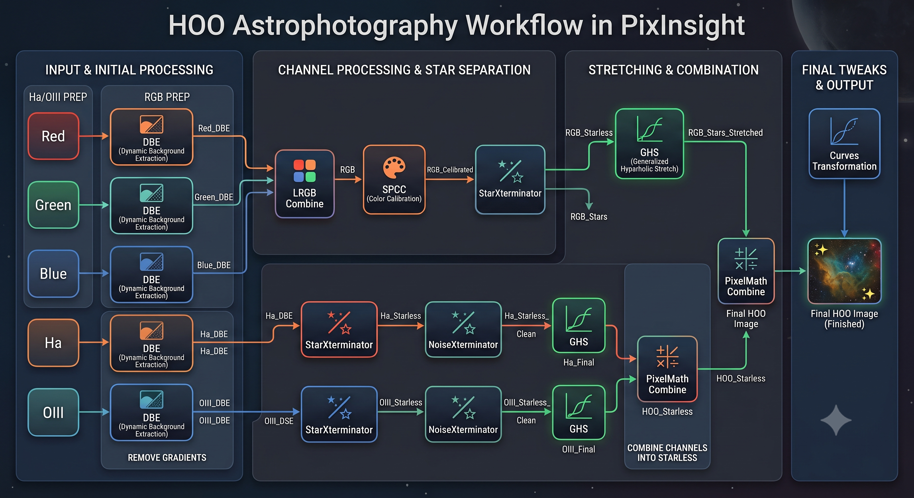

Here's a breakdown of the exact process I follow in PixInsight when processing narrowband data for HOO specifically.

---

### 1. Process RGB Channels (for RGB Stars)

I like getting natural star colors by processing separate RGB subframe stacks first:

* **DBE**: Run Dynamic Background Extraction on `Red`, `Green`, `Blue` -> `Red_DBE`, `Green_DBE`, `Blue_DBE`

* **LRGB Combine**: Combine `Red_DBE`, `Green_DBE`, `Blue_DBE` -> `RGB`

* **SPCC**: Run Spectrophotometric Color Calibration on `RGB` -> `RGB_Calibrated`

* **StarXTerminator**: Run StarXTerminator on `RGB_Calibrated` -> `RGB_Starless`, `RGB_Stars`

* **Stretch Stars**: Stretch `RGB_Stars` using Generalized Hyperbolic Stretch (GHS) -> `RGB_Stars_Stretched`

---

### 2. Process Ha & OIII Channels

Next, I work on the Ha and OIII narrowband data:

* **DBE**: Run Dynamic Background Extraction on `Ha` and `OIII` -> `Ha_DBE`, `OIII_DBE`

* **StarXTerminator**: Strip stars from both -> `Ha_Starless`, `OIII_Starless`

* **NoiseXTerminator**: Denoise both -> `Ha_Starless_Clean`, `OIII_Starless_Clean`

* **Stretch Nebulae**: Stretch both narrowband layers using Generalized Hyperbolic Stretch (GHS) -> `Ha_Final`, `OIII_Final`

---

### 3. Combine Channels & Add Stars Back

* **PixelMath HOO Combine**: Combine `Ha_Final` and `OIII_Final` in PixelMath -> `HOO_Starless`

* **PixelMath Star Blend**: Combine `HOO_Starless` and `RGB_Stars_Stretched` -> `Final HOO Image`
    * For the RGB Stars, you might want to reduce your stars here if they are too bright or big. I use Bill Blanshan's reduction scripts for this. I don't remember exactly where I got them so I can't link to them. 

---

### 4. Final Tweaks

* **Curves**: Run CurvesTransformation on `Final HOO Image` for final contrast, saturation, and color adjustments.
